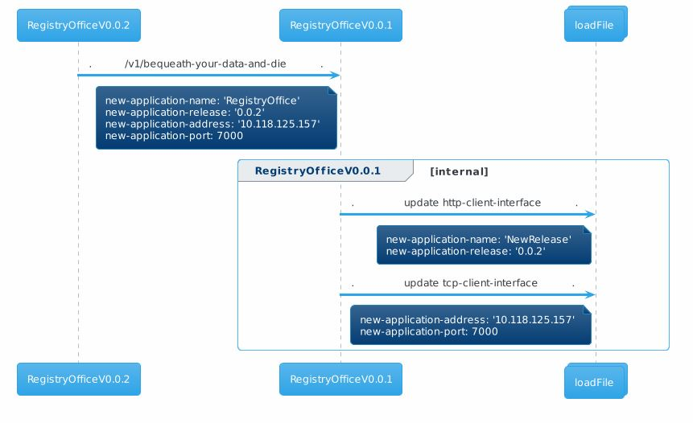
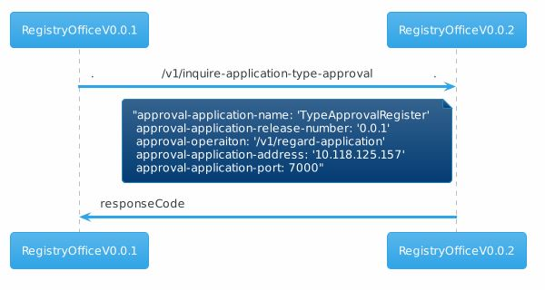
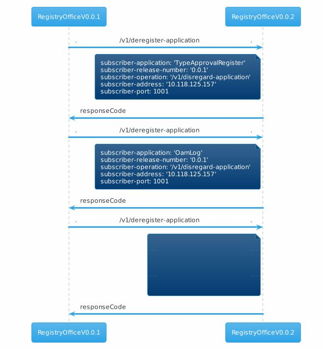
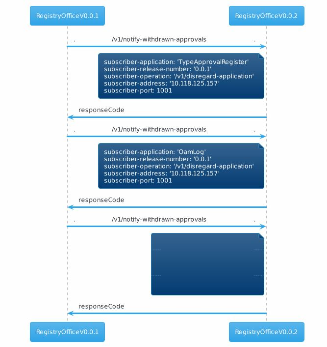
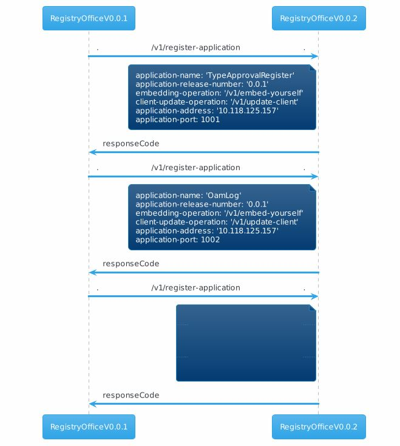
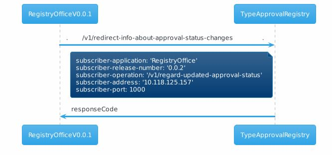
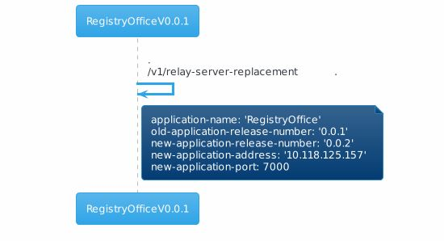
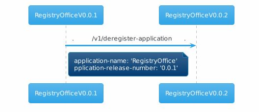

# /v1/bequeath-your-data-and-die

Ultimate goal of this service is to perform software version or instance upgrade without(or with minimum) downtime. This service will be initiated by a new application to the old(or same) version of the same application. The functionality within this service performs a set of procedure to transfer the data from old application to new application using callbacks.

Every new version will be backward compatible with its immediate previous version for a smooth integration with multiple MS. So, software version upgrades should be sequential in order to have a backward compatible version.

unlike others , this service is not a straightforward one. It has to perform a number of callbacks to transfer the data from old to new version.

To perform upgrade(or instance change) , old and new version of the Registry office will proceed as mentioned below (in a high level),

The callbacks will be executed in the waterfall model. And if one callback fails, then rest of the callbacks will not be performed further.

## Configuration:

The following interfaces will be created and added to the logical-termination-point list in the control-construct,

| **S.No** | **Layer protocol name** | **Details** |
| --- | --- | --- |
| 1 | http-client-interface | The existing http-client with application-name &quot;new-release&quot; will be updated with the new-application-release. |
| 2 | tcp-client-interface | The existing tcp-client will be updated with the new-application-address and port. |

No configuration in the forwarding-construct.

## Forwarding:

After successful processing, parallel notifications will be triggered for the following forwarding-constructs that corresponds to the update happed in the load file ,

| **S.No** | **Forwarding-construct name** | **Details** |
| --- | --- | --- |
| 1 | ServiceRequestCausesLtpUpdateRequestALT: /v1/update-ltp | Modification to the LTP instance will be notified to ALT. |
| 2 | ServiceRequestCausesLoggingRequestEaTL: /v1/record-service-request | A trigger will be sent to EaTL to record the service request. |

Apart from the above forwarding , the following services will be initiated to perform the upgrade ,

**PromptForBequeathingDataCausesNewApplicationBeingRequestedToInquireForApplicationTypeApprovals :**

This forwarding is to transfer the information about the Type approval application. Old application identifies the correct instance by using the &quot;RegistrationCausesInquiryForApplicationTypeApproval&#39; forwardingName

**PromptForBequeathingDataCausesNewApplicationBeingRequestedToDocumentSubscriptionsForDeregistrationNotifications :**

This forwarding is to transfer the information about the applications subscribed for deregistration notification. The subscribed application information will be identified by the &quot;DeregistrationNotification&quot; forwardingName.

**PromptForBequeathingDataCausesNewApplicationBeingRequestedToDocumentSubscriptionsForApprovalNotifications:**

This forwarding is to transfer the information about the applications subscribed for approval notification. The subscribed application information will be identified by the &quot;ApprovalNotification&quot; forwardingName.

**PromptForBequeathingDataCausesNewApplicationBeingRequestedToDocumentSubscriptionsForWithdrawnApprovalNotifications**

This forwarding is to transfer the information about the applications subscribed for withdrawn approval notification. The subscribed application information will be identified by the &quot;WithdrawnApprovalNotification&quot; forwardingName.

**PromptForBequeathingDataCausesTransferOfListOfAlreadyRegisteredApplications :**

This forwarding is to transfer the information about the registered applications. Apart from the &quot;old&quot; and &quot;new&quot; release , all the other application information will be transferred as a part of this callback.

**PromptForBequeathingDataCausesTARbeingRequestedToRedirectInfoAboutApprovalsToNewApplication :**

This forwarding will initiate a request to the &quot;TypeApprovalRegistry&quot; application to redirect the application &quot;approval status change&quot; to the new version.

**PromptForBequeathingDataCausesRequestForBroadcastingInfoAboutServerReplacement:**

This forwarding will initiate a request to the &quot;old Registry office&quot;(that is, to its own) application to broadcast about the new release to all the approved application in the SDN MS environment.

**PromptForBequeathingDataCausesRequestForDeregisteringOfOldRelease :**

At this point of time , the old registry office might have transferred all its data to the new application. And now , the new application is the active registry office.

This forwarding will deregister the old Registry Office from the SDN MS environment.

